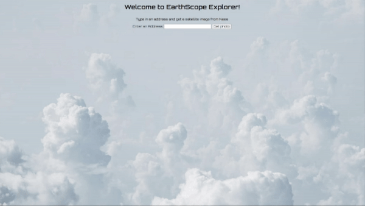

**`Full Stack Software Engineer`**
    
I'm a Full Stack Software Engineer and college student who is passionate about leveraging technology to solve real-world problems. This profile showcases my expertise in building full stack web applications using the latest technologies and best practices. I'm constantly improving my skills in order to deliver innovative and efficient solutions.

---
    
### <Languages & Tools/>

 

#

### 🚀 Recent Projects

<table bordercolor="#66b2b2">
  
  <tr>
  <td width="50%" valign="top">
  <h3 align="left">Gopher Market</h3>
     
    
     
    

      
      
    

    
<strong>Node.js, Express.js, MongoDB, EJS</strong> - full stack web app built for umn gophers marketplace

    </td>
    <td width="50%" valign="top">
      <h3 align="left">EarthScope Explorer</h3>
         
        
         
        

            
          
        

        
<strong>JavaScript, NASA API, GELOKY API</strong> - Web App that displays sattelite images from NASA from any location on earth!

    </td>
    
  </tr>

</table>
